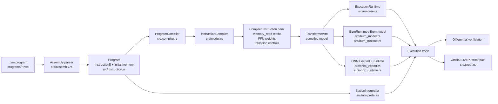
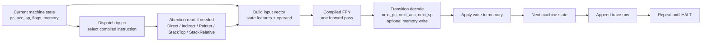
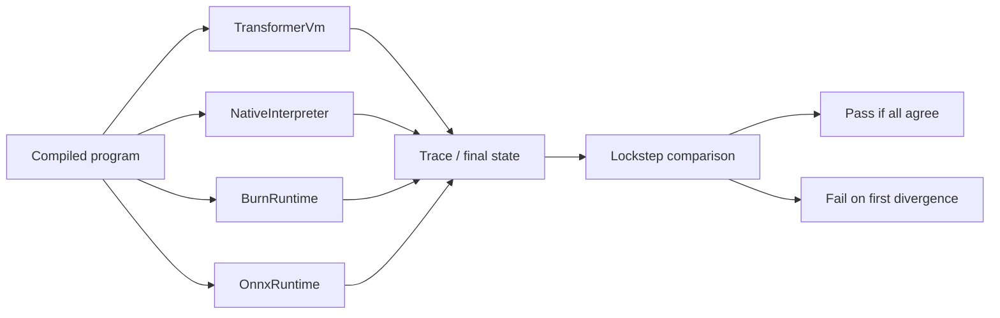
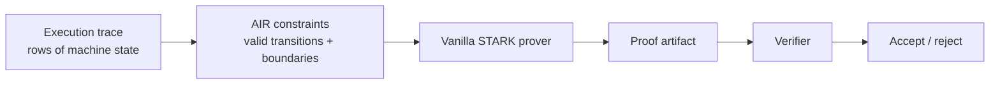

# Architecture

This document separates the system into two views:

- design-time: how a `.tvm` program becomes compiled transformer blocks
- runtime: how one execution step happens

GitHub renders the diagrams below directly because they use Mermaid.

## 1. Design-Time Architecture

This is the compile pipeline.



## 2. What Gets Baked Into Weights

Each instruction in the program is compiled ahead of time into a small deterministic block.

Conceptually:

```text
Instruction -> CompiledInstruction {
  memory_read,
  ff_weights,
  transition_controls
}
```

Example:

```text
ADD 3
```

becomes a block whose FFN computes:

```text
next_pc = pc + 1
next_acc = acc + 3
next_sp = sp
```

Example:

```text
LOADP 1
```

becomes:

```text
memory_read = Indirect(1)
next_pc = pc + 1
next_acc = operand
next_sp = sp
```

So the program text is not fed to the model at runtime. The program is compiled first, and runtime only selects the already-baked block for the current `pc`.

## 3. Runtime Architecture

This is one execution step.



## 4. Runtime Step In Plain English

At runtime:

1. Read the current state.
2. Use `pc` to choose the current instruction.
3. If that instruction needs memory, use attention to fetch the operand.
4. Run the baked FFN for that instruction once.
5. Decode the FFN output into the next state.
6. Apply any memory write.
7. Record the trace row.
8. Continue.

That means:

- attention = retrieval
- FFN = compute next state

## 5. Differential Verification Architecture

The repo does not trust only one execution engine.



This is not the STARK proof. It is an engineering cross-check.

## 6. STARK Overlay

The STARK sits on top of the execution trace.



Meaning:

- execution engines do the computation
- the STARK proves that the trace obeys the VM rules

## 7. File Map

Core files:

- [src/assembly.rs](../src/assembly.rs): parses `.tvm`
- [src/instruction.rs](../src/instruction.rs): ISA and `Program`
- [src/compiler.rs](../src/compiler.rs): program compilation entry point
- [src/model.rs](../src/model.rs): compiled transformer logic, attention read modes, FFN baking
- [src/runtime.rs](../src/runtime.rs): transformer runtime loop
- [src/interpreter.rs](../src/interpreter.rs): native semantic oracle
- [src/burn_model.rs](../src/burn_model.rs): Burn execution path
- [src/onnx_export.rs](../src/onnx_export.rs): ONNX export
- [src/onnx_runtime.rs](../src/onnx_runtime.rs): ONNX runtime path
- [src/proof.rs](../src/proof.rs): vanilla STARK proof layer

## 8. One-Sentence Summary

Design-time compiles each VM instruction into a deterministic transformer block; runtime repeatedly selects the block for the current `pc`, retrieves memory through attention, runs one FFN pass, updates state, and optionally proves the resulting trace with a STARK.
